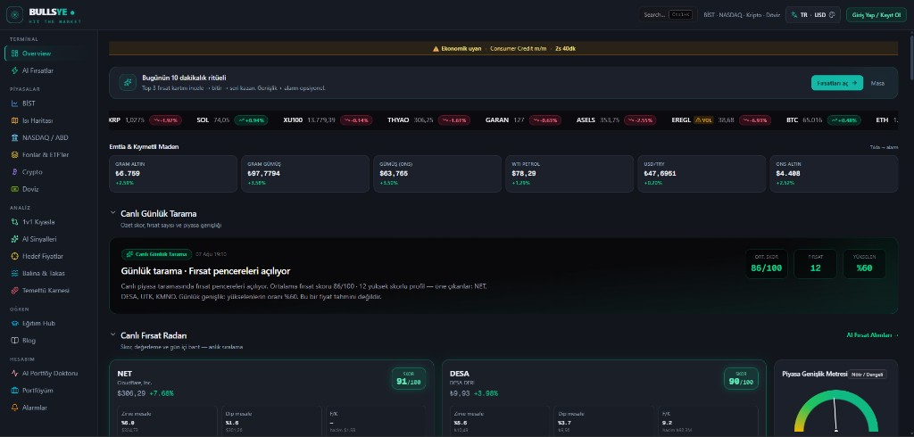
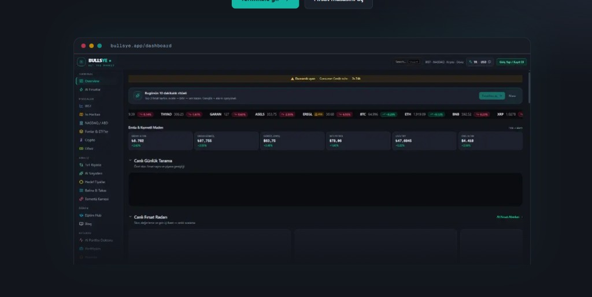

<p align="center">
  
</p>

<h1 align="center">Bullsye</h1>

<p align="center">
  <strong>Her sabah 10 dakikada piyasayı okuyun.</strong><br />
  BİST, kripto, döviz ve fonlar — tek terminalde, ücretsiz.
</p>

<p align="center">
  <a href="https://bullsye.app">bullsye.app</a> ·
  <a href="https://bullsye.app/terminal">Terminale git</a> ·
  <a href="https://bullsye.app/firsatlar">Fırsat Radarı</a>
</p>

<br />

<p align="center">
  
</p>

---

## Bu nedir?

Bullsye, Türkiye odaklı bir **finans analiz terminali**.  
Amacı veri yığını göstermek değil; sabah rutininizde **“Bugün neye bakayım?”** sorusuna hızlı cevap vermek.

- Canlı BİST, ABD hisseleri, kripto, döviz ve emtia
- AI **Fırsat Skoru** (100 üzerinden)
- Analist hedef fiyatları ve temettü takibi
- Alarm, portföy ve öğrenme içerikleri

Yatırım tavsiyesi değildir — karar sizin, araç bizim.

---

## Kimler için?

| Sizin durumunuz | Bullsye nasıl yardım eder |
| --- | --- |
| Her sabah BİST’e 10 dk bakmak istiyorsunuz | Overview + fırsat kartları ile hazır rutin |
| Ücretli terminal / veri aboneliği istemiyorsunuz | Temel tarama ücretsiz |
| “Ne bakayım?”da kayboluyorsunuz | Skor, ısı haritası ve radar önceliklendirir |
| Hem hisse hem kripto takip ediyorsunuz | Tek ekranda birleşik görünüm |

---

## Neler yapabilirsiniz?

### 1. Canlı sabah terminali
Endeks, genişlik, emtia/kur şeridi ve günlük tarama — piyasayı tek bakışta özetler.

<p align="center">
  
</p>

### 2. AI Fırsat Radarı
Yüzlerce sinyali tek skora indirger. Her kartta skor, dip/zirve mesafesi ve kısa gerekçe satırları görünür.

<p align="center">
  
</p>

### 3. Piyasalar
- **BİST** screener ve ısı haritası  
- **NASDAQ / ABD** hisseleri  
- **Kripto** radar  
- **Fon & ETF**, döviz ve emtia

### 4. Analiz araçları
- AI alım/satım sinyalleri  
- 12 aylık analist hedef fiyatları  
- Temettü karnesi  
- Balina / büyük hareket takibi  
- 1v1 karşılaştırma

### 5. Portföy & alarm
Pozisyonlarınızı izleyin, fiyat alarmı kurun; **AI Portföy Doktoru** ile sektörel yığılma riskine bakın.

### 6. Öğren
Eğitim hub’ı ve blog: RSI, temettü, BİST rutini gibi konular — her yazıdan canlı araca köprü.

---

## Tipik 10 dakikalık rutin

1. **Overview** — endeks + genişlik + emtia  
2. **Fırsat Masası** — en yüksek 3 skor  
3. İlgilendiğiniz varlıkta **alarm** kurun  
4. Ekranı kapatın — yarın aynı ritüel

---

## Neden Bullsye?

- **TR-first** — BİST ve günlük yatırımcı dilinde  
- **Karar odaklı** — ham veri değil, skor ve bağlam  
- **Ücretsiz giriş** — abonelik duvarı olmadan terminal  
- **Tek çatı** — hisse, kripto, fon, öğrenme bir arada  

---

## Hızlı başlangıç (geliştiriciler)

```bash
npm install
npm run dev
```

Tarayıcıda [http://localhost:3000](http://localhost:3000)

Daha fazla teknik detay: [Mimari](docs/ARCHITECTURE.md) · [API](docs/API.md) · [Veri akışı](docs/DATA_FLOW.md)

---

<p align="center">
  <strong>Hedefi vur.</strong><br />
  <a href="https://bullsye.app">https://bullsye.app</a>
</p>
